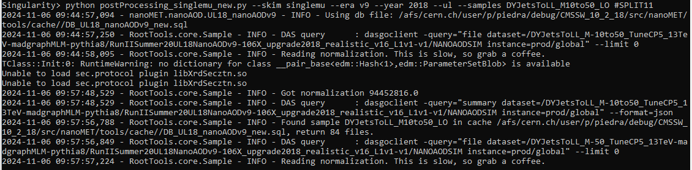

Instructions extracted from the [MET Significance studies using nanoAOD](https://twiki.cern.ch/twiki/bin/viewauth/CMS/METSignificance) TWiki.

# 1. Installation

Log in to the CERN LXPLUS cluster.

    ssh -Y -l <user> lxplus.cern.ch -o ServerAliveInterval=240

The code has to be run with an el7 image. Follow the [El7 image with condor support for lxplus](https://gitlab.cern.ch/cms-cat/cmssw-lxplus/) instructions to create a `start_el7.sh` script, and then make it executable.

    chmod u+x start_el7.sh

Now you can run it.

    ./start_el7.sh

Initialize a CMSSW release.

    unset SCRAM_ARCH
    cmsrel CMSSW_10_2_18
    cd CMSSW_10_2_18/src/
    cmsenv

Clone the needed git repositories.

    cd $CMSSW_BASE/src
    git cms-init
    git clone https://github.com/cesarecazzaniga/nanoMET
    git clone https://github.com/HephyAnalysisSW/RootTools.git
    git clone https://github.com/HephyAnalysisSW/Samples.git

Checkout the custom tools for the MET Significance producer.

    git clone https://github.com/cms-nanoAOD/nanoAOD-tools.git PhysicsTools/NanoAODTools
    cd PhysicsTools/NanoAODTools
    git remote add metsig https://github.com/cesarecazzaniga/nanoAOD-tools.git
    git fetch metsig
    git checkout metsig/MetSig_devel

Checkout JetMETCorrections.

    cd $CMSSW_BASE/src
    git cms-addpkg JetMETCorrections

Get the JER files.

    sh $CMSSW_BASE/src/nanoMET/core/data/JER/getJER.sh

Some user specific paths are hardcoded in the nanoMET repository. Edit the `$CMSSW_BASE/src/nanoMET/tools/python/user.py` file and add the paths suited for your setup.

| Path name                         | Path description                        |
|:----------------------------------|:----------------------------------------|
| `plot_directory`	                | Path to store produced plots            |
| `postprocessing_output_directory` | Path to the nanoMET flat ntuples output |
| `data_directory`	                | Path to the postprocessed samples       |
| `dbDir`	                        | Path to the used samples database       |

# 2. Always do

    ssh -Y -l <user> lxplus.cern.ch -o ServerAliveInterval=240
    
    ./start_el7.sh

    cd CMSSW_10_2_18/src
    cmsenv
    scram b -j 8
 
# 3. Get a proxy certificate

    voms-proxy-init -voms cms --valid 192:00 --vomslife 192:0

# 4. Caching normalization in samples

This step should be performed only when a sample has been added.

    python $CMSSW_BASE/src/nanoMET/nanoAOD/python/UL18_nanoAODv9.py
    python $CMSSW_BASE/src/nanoMET/nanoAOD/python/UL18_DATA_nanoAODv9.py

# 5. Postprocessing samples

    cd $CMSSW_BASE/src/nanoMET/postprocessing

Test interactively with the `DYJetsToLL_M10to50_LO` sample in `postProcessing_2018_mu_nanoAODv9.sh`.

    python postProcessing_singlemu_new.py --skim singlemu --era v9 --year 2018 --ul --samples DYJetsToLL_M10to50_LO #SPLIT11

To test the condor submission, copy the file `postProcessing_2018_mu_nanoAODv9.sh` as `postProcessing_condor_test.sh` and keep only the `DYJetsToLL_M10to50_LO` sample.

    submitCondor.py --dpm --queue tomorrow --execFile condor.sh postProcessing_condor_test.sh --logLevel DEBUG

Submit to condor.
    
    submitCondor.py --dpm --queue tomorrow --execFile condor.sh postProcessing_2018_mu_nanoAODv9.sh

Location of the condor log files.

    /afs/cern.ch/work/${USER::1}/$USER/condor_output/
